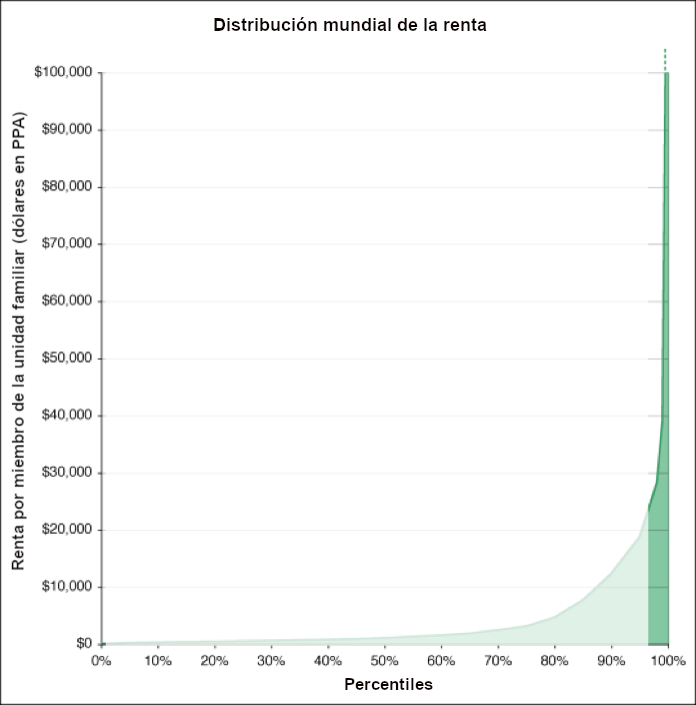
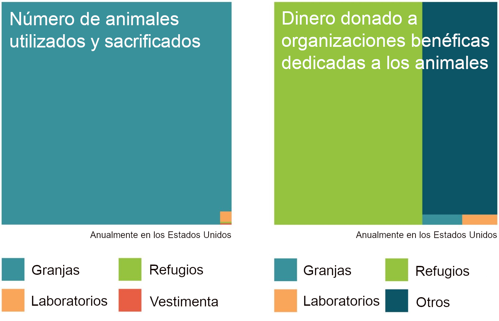

> Crea toda la felicidad que seas capaz de crear; elimina toda la miseria que seas capaz de eliminar. Cada día te permitirá, te invitará a añadir algo al placer de los demás, o a disminuir algo de sus penas."_ \
> \- [Jeremy Bentham](https://altruismoeficaz.net/autores/jeremy-bentham)[^1]



## Introducción

Hasta ahora hemos examinado el utilitarismo desde un punto de vista teórico. Pero, ¿qué significa realmente el utilitarismo en la práctica? ¿Qué acciones concretas dice que debemos realizar? Este artículo explica la significación de vivir una vida ética desde la perspectiva del utilitarismo.

Hay muchos problemas en el mundo de hoy, algunos de los cuales son de enorme importancia. Según el utilitarismo, cada persona tiene la obligación de trabajar en estos problemas y tratar de mejorar el mundo en la medida de lo posible, asignando la misma importancia al bienestar de todos. Por desgracia, nuestros recursos son escasos, así que como individuos e incluso como sociedad global no podemos resolver todos los problemas del mundo a la vez. Esto significa que debemos tomar decisiones sobre el modo de priorizar los recursos de que disponemos. Dado que no todas las formas de ayudar a los demás son igual de eficaces, el utilitarismo implica que debemos elegir cuidadosamente en qué problemas trabajar y con qué medios.

Para hacer el mayor bien posible en la práctica, muchos utilitaristas donan una parte significativa de sus ingresos para contribuir a resolver los problemas del mundo más apremiantes, dedican su carrera profesional a hacer el bien y aspiran a altos grados de cooperación, integridad personal y honradez.

A lo largo de este artículo, utilizamos expresiones como "hacer el bien" y "tener un impacto" para referirnos, de forma abreviada, a aumentar el bienestar de los demás, en particular mediante el fomento de la felicidad y la prevención del sufrimiento.

## Oportunidades para ayudar a los demás

La riqueza y la renta están distribuidas de forma muy desigual en todo el mundo. Los miembros de la clase media de países ricos como EE. UU. y el Reino Unido ganan 50 veces más que los 750 millones de personas más pobres del mundo, lo que los ubica en el 5 % más rico de la población mundial.[^2] Esta disparidad de la riqueza significa que los ciudadanos acomodados de las naciones prósperas tienen grandes oportunidades de beneficiar a los demás.

> _Ganar más de $29.000 al año te sitúa en el 5 % más rico de la población mundial._ Cf. Giving What We Can (2019) [How rich am I? World income percentile calculator: global rich list](https://howrichami.givingwhatwecan.org/how-rich-am-i?income=29000&countryCode=USA&household%5Badults%5D=1&household%5Bchildren%5D=0), *Giving What We Can*.

La riqueza y la renta exhiben lo que los economistas llaman _utilidad marginal decreciente_.[^3] La idea es simple: el grado en que aumenta el bienestar de una persona que recibe mayores ingresos depende de sus ingresos actuales. Aunque las personas más ricas dicen estar más satisfechas con su vida en general, cuanto más rico se es, menos bienestar se obtiene con una misma cantidad adicional de dinero. Un agricultor pobre de Kenia se beneficiará mucho más de recibir un dólar extra que un miembro de la clase media de un país rico.

La utilidad marginal decreciente del dinero implica que, en general, podemos aumentar el bienestar general redistribuyendo de los ricos a los pobres. Como ciudadanos de países ricos, el bienestar al que renunciamos al donar $100 es pequeño comparado con el beneficio que este dinero proporcionará a alguien que vive en la pobreza extrema. En lugar de comprarte unos zapatos nuevos, tu donación podría proporcionarle a alguien el equivalente a un año o más de vida saludable.[^4]

Dada la utilidad marginal decreciente del dinero, el flagelo de la desigualdad mundial extrema implica que podemos hacer un bien asombroso donando a los pobres del mundo o a otros grupos desfavorecidos. Por unos pocos dólares —el precio de un café— podríamos pagar una mosquitera tratada con insecticida que durante dos años protegería de la malaria a dos niños de un país en desarrollo.[^5] Y este dinero puede llegar aún más lejos si se gasta en programas eficaces en otras áreas de trabajo.

El utilitarismo implica que ayudar a los demás debe ser una parte central de nuestras vidas. Además, el utilitarismo nos insta a utilizar nuestros recursos no sólo para hacer el bien, sino para hacer el mayor bien posible. Si no conseguimos producir el mejor resultado posible, morirá más gente de la que tenía que morir o sufrirá daños mayores de los que tenía que sufrir. Si pensamos que los graves daños que sufren otras personas en este mundo son lo suficientemente urgentes como para que tengamos el deber de utilizar parte de nuestros recursos para impedir que ocurran, ese mismo deber nos exige utilizar esos recursos de forma que ayuden lo máximo posible.

¿Cuánto debemos sacrificar en beneficio de los demás? Tratándose de ciudadanos acomodados de los países ricos, el utilitarismo dirá que deben donar una parte sustancial de sus recursos para ayudar a los demás. Sin embargo, los utilitaristas reconocen que, a la hora de decidir cuánto hay que donar, es importante no consentir que lo mejor sea enemigo de lo bueno. Sería un error donar tanto a corto plazo que luego nos sintiéramos miserables y nos agotáramos. En la práctica, la mayoría de los utilitaristas intentan calcular un nivel de sacrificio que les resulte sostenible a largo plazo; para los [utilitaristas centrados en las donaciones](https://80000hours.org/articles/earning-to-give/), suele estar entre el 10 % y el 50 % de sus ingresos brutos.

## El altruismo eficaz

Muchos utilitaristas realizan sacrificios personales considerables debido a su creencia en el utilitarismo. Pero recientemente algunos han argumentado que _cuánto_ se sacrifica no es tan importante como _qué_ se intenta hacer. Ésta es una idea clave del _[altruismo eficaz](https://altruismoeficaz.net/)_, una filosofía y un movimiento social respaldado por muchos utilitaristas, como [Peter Singer](https://altruismoeficaz.net/autores/peter-singer).[^6]

Los partidarios del altruismo eficaz intentan averiguar, de entre todos los usos posibles de nuestros recursos, cuáles son los más beneficiosos, considerados imparcialmente, y actúan en consecuencia. Así definido, el altruismo eficaz es tanto un proyecto de investigación que busca cómo hacer el mayor bien como un proyecto práctico que intenta aplicar las mejores conjeturas que tenemos sobre cómo hacer el mayor bien.[^7]

Aunque el utilitarismo y el altruismo eficaz comparten ciertas similitudes,[^8] son distintos y difieren en aspectos importantes.[^9] A diferencia del utilitarismo, el altruismo eficaz no exige que [sacrifiquemos nuestros propios intereses](./objeciones-al-utilitarismo/exigencia.md) siempre que hacerlo suponga un mayor beneficio para los demás. A diferencia del utilitarismo, el altruismo eficaz no afirma que siempre deberíamos tratar de maximizar el bienestar, [independientemente de los medios que utilicemos para lograrlo](./objeciones-al-utilitarismo/derechos.md). Por último, a diferencia del utilitarismo, el altruismo eficaz no equipara el bien con la suma total del bienestar.[^10] Por estas y otras razones, muchos miembros de la comunidad del altruismo eficaz no son utilitaristas, y en su lugar suelen dar cierta importancia a una serie de teorías éticas no utilitaristas.

A pesar de estas diferencias, los utilitaristas suelen mostrar entusiasmo por el altruismo eficaz. La razón principal es que, de todas las comunidades, el movimiento del altruismo eficaz es el que más se acerca a la aplicación de las ideas y valores utilitaristas fundamentales al mundo real.

Además, unirse a una comunidad de personas con objetivos compartidos como el altruismo eficaz puede ser una de las mejores formas de que sus miembros aumenten su impacto. Una comunidad de este tipo permite a un grupo de personas prestarse apoyo mutuo y coordinarse de forma más eficaz, consiguiendo así más de lo que podrían lograr a título individual.

Los miembros del movimiento del altruismo eficaz suelen descomponer el problema de cómo hacer el mayor bien posible en dos partes. En primer lugar, ¿en qué problema (o "causa") debo centrarme? En segundo lugar, ¿qué medios debo adoptar para abordar esos problemas? Analizaremos estas dos cuestiones en el resto de este artículo.

## Priorización de causas

Para averiguar cuáles son las acciones más eficaces, primero tenemos que saber en qué causas centrarnos. Los utilitaristas son [imparciales respecto a las causas](./utilitarismo-y-etica-practica.md#imparcialidad-respecto-a-las-causas), lo que significa que pretenden contribuir a las causas en las que esperan tener el mayor impacto. ¿Qué causas promoverían más eficazmente el bienestar si se les prestara más atención? El intento de responder a esta pregunta se denomina "priorización de causas".

Dado que algunos problemas morales pueden ser mucho más importantes que otros, elegir en qué causa centrarse puede ser el factor que determine, más que ningún otro, cuánto bien hará una persona a lo largo de su vida. Sin embargo, el mundo es complejo y nos enfrentamos a una gran incertidumbre sobre cuáles son las mejores formas de hacer el bien. Esta incertidumbre provoca un desacuerdo razonable sobre cuáles son las mejores causas en las que trabajar. Pero la comunidad del altruismo eficaz ha [hecho algunos progresos](https://altruismoeficaz.net/temas/marco-itd) en la definición de tres causas sociales que parecen especialmente apremiantes: (i) la salud y el desarrollo globales, (ii) el bienestar animal en las granjas, y (iii) la reducción del riesgo existencial.

### Salud y desarrollo globales

> _”Algo que importa mucho es que nosotros, los ricos, hayamos permitido gran parte del sufrimiento y muchas de las muertes prematuras de las personas más pobres del mundo que podríamos haber evitado muy fácilmente."_   \- Derek Parfit[^11]

Como se explica en el capítulo [Utilitarismo y ética práctica](./utilitarismo-y-etica-practica.md#cosmopolitismo), los utilitaristas apoyan el cosmopolitismo, según el cual la distancia geográfica entre un actor y el beneficiario potencial de su ayuda no es moralmente relevante en sí misma. El cosmopolitismo implica que debemos buscar intervenciones eficaces para ayudar a los demás, con independencia de su nacionalidad, de su lugar de residencia o de su procedencia.

Sobre esta base, se puede considerar la salud y el desarrollo globales como una causa especialmente prioritaria para los utilitaristas.[^12] Los esfuerzos en este ámbito tienen un gran historial de mejoras en la vida de la gente, lo que hace que esta causa parezca especialmente tratable. Durante la mayor parte de la historia de la humanidad, lo normal era que aproximadamente dos de cada cinco niños murieran antes de cumplir los cinco años, en gran parte por causas evitables. Gracias a la mejora de las condiciones de salubridad y al acceso a la atención médica, desde entonces hemos avanzado enormemente en la lucha contra la mortalidad infantil, y las tasas mundiales descendieron a solo el 4,5 % en 2015.[^13]

<iframe src="https://ourworldindata.org/grapher/global-child-mortality-timeseries" loading="lazy" style="width: 100%; height: 600px; border: 0px none;"></iframe>

Sin embargo, este progreso no es motivo para dormirnos en los laureles, ya que aún nos queda mucho camino por recorrer: una tasa de mortalidad infantil del 4,5 % sigue significando que alrededor de 15.000 niños mueren cada día en todo el mundo.[^14] Afortunadamente, podemos ayudar a disminuir esta cifra aún más. Las mejores intervenciones en salud y desarrollo globales son increíblemente costo-eficaces: [GiveWell](https://www.givewell.org/), una organización líder que realiza evaluaciones exhaustivas de organizaciones benéficas, calcula que las organizaciones benéficas que recomienda pueden evitar la muerte de un niño por malaria por menos de 5.000 dólares mediante el suministro de medicamentos preventivos.[^15]

Otras formas de ayudar a los más pobres, costo-eficaces y respaldadas por evidencia sólida, son la administración de tratamientos de desparasitación, la distribución de mosquiteras contra la malaria, la fortificación con vitamina A y las transferencias de dinero.[^16] Todas estas intervenciones ofrecen oportunidades increíbles de mejorar el bienestar de los demás a un costo muy bajo para nosotros.

### Bienestar animal en las granjas

> La pregunta no es ‘¿Pueden *razonar*?’, ni ‘¿Pueden *hablar*?’, sino ‘¿Pueden *sufrir*?’ ¿Por qué debería la ley negar su protección a cualquier ser sensible?… Llegará el momento en que la humanidad extenderá su manto sobre todo lo que respire."_   \- [Jeremy Bentham](https://altruismoeficaz.net/autores/jeremy-bentham)[^17]

Mejorar el bienestar de los animales de granja debería ser una alta prioridad moral para los utilitaristas. El argumento para llegar a esta conclusión es sencillo: primero, los animales importan moralmente; segundo, los humanos causan una enorme cantidad de sufrimiento innecesario a los animales en los criaderos intensivos; tercero, hay formas fáciles de reducir el número de animales de granja y la gravedad de su sufrimiento. Examinaremos estas premisas una por una.

En primer lugar, como se explica en el capítulo [Utilitarismo y ética práctica](./utilitarismo-y-etica-practica.md#especismo), los utilitaristas rechazan el especismo: la discriminación contra quienes no pertenecen a una determinada especie. Desde la óptica del utilitarismo, debemos dar la misma consideración moral al bienestar de todos los individuos, independientemente de la especie a la que pertenezcan.[^18]

En segundo lugar, nos encontramos en una situación sin precedentes históricos, en la que cada año los seres humanos matan alrededor de 70.000 millones de animales terrestres para alimentarse.[^19] La gran mayoría de ellos pasan su vida en criaderos intensivos en condiciones horrendas,[^20] hacinados, sin luz natural ni estímulos, y en riesgo constante de desarrollar dolencias como huesos debilitados o rotos, infecciones y fallo de órganos. La vida de la mayoría termina prematuramente cuando son sacrificados como alimento. Estos animales que sufren se encuentran probablemente entre las criaturas en peor situación de este planeta.

En tercer lugar, podemos mejorar significativamente la vida de los animales de granja por sólo unos centavos por animal. En los últimos años, los activistas han hecho campaña para que muchos supermercados y cadenas de comida rápida eliminen los huevos de jaula de sus cadenas de suministro. Las investigaciones sugieren que estas campañas corporativas para el bienestar animal han mejorado significativamente la vida de entre 9 y 120 gallinas por dólar gastado, evitándoles un año de confinamiento en jaulas.[^21] Debido a la enorme cantidad de seres sintientes involucrados, avanzar en la mejora del bienestar animal en las granjas podría evitar una enorme cantidad de sufrimiento.

Sin embargo, a pesar de la magnitud del problema, el bienestar animal en las granjas está muy desatendido.

En EE. UU., sólo se donan unas pocas decenas de millones de dólares filantrópicos al año a organizaciones que se centran en mejorar la vida de los animales de granja. La cantidad gastada es ínfima en comparación con otras causas relacionadas con los animales: hay 3.000 veces más animales en los criaderos intensivos que mascotas callejeras, pero los esfuerzos para combatir la cría intensiva de animales reciben una quincuagésima parte de los fondos destinados a ayudar a esos animales domésticos.[^22]

### Reducción del riesgo existencial

> Los utilitaristas clásicos... afirmarían, como Sidgwick, que la destrucción de la humanidad sería con mucho el mayor de todos los crímenes concebibles. La gravedad de este crimen residiría en la enorme reducción de la suma posible de felicidad."_ \- Derek Parfit[^23]

El capítulo [Utilitarismo y ética práctica](./utilitarismo-y-etica-practica.md#largoplacismo) introdujo el _largoplacismo fuerte_, según el cual el determinante más importante del valor de nuestras acciones presentes es cómo afectan al futuro a largo plazo. El largoplacismo fuerte se deriva del utilitarismo —y de muchos otros puntos de vista morales— si asumimos que algunas de nuestras acciones pueden influir significativamente en el futuro a largo plazo y que podemos estimar sus efectos positivos y negativos.[^24]

Desde el punto de vista del largoplacismo, los problemas morales más importantes son aquellos que nos ofrecen la posibilidad de ejercer la mayor influencia positiva en las generaciones futuras. En concreto, deberían preocuparnos mucho los _riesgos existenciales_ (como una guerra nuclear total, un cambio climático extremo o una pandemia artificial), que se definen del siguiente modo:

> **Un riesgo existencial es un riesgo que amenaza con destruir el potencial a largo plazo de la humanidad.**[^25]

Además de la muerte de los 8.000 millones de habitantes del planeta, una catástrofe existencial supondría también la pérdida de todo el potencial futuro de la humanidad. En resumen, si se produjera una catástrofe existencial, la pérdida de valor sería astronómica.[^26]

Si evitamos que se produzca una catástrofe existencial, la civilización humana podría sobrevivir unos mil millones de años antes de que la Tierra deje de ser habitable. Y si algún día colonizáramos otros planetas, la civilización podría continuar durante miles de millones o billones de años más.[^27] También podemos esperar que la calidad de vida siga mejorando. En los últimos siglos hemos asistido a mejoras espectaculares del bienestar humano, impulsadas por el desarrollo tecnológico y el progreso moral. Estas tendencias han permitido a muchos de nosotros vivir vidas más largas y plenas.[^28] Afortunadamente, cabe esperar que los avances científicos y médicos sigan mejorando la calidad de vida en el futuro.

Por lo tanto, la extinción de la especie humana privaría irreversiblemente a la humanidad de un futuro potencialmente grandioso y supondría la pérdida de billones de vidas futuras. La materialización de un riesgo existencial sería excepcionalmente mala, y mucho peor que las catástrofes no existenciales. Dado que es mucho lo que está en juego con estos riesgos, su mitigación puede ser una de las cuestiones morales más importantes a las que nos enfrentamos.[^29]

Trabajar para que el futuro a largo plazo de la humanidad sea bueno no sólo es muy importante, sino que también está muy desatendido. Las personas del futuro no pueden influir en las decisiones que tomamos hoy en nuestros sistemas económicos y políticos; no participan en los mercados ni tienen voto. En esencia, los individuos del futuro no tienen voz. En este contexto, no es de extrañar que nuestra generación desatienda sistemáticamente los intereses y el bienestar de los muchos individuos que existirán en el futuro.

Para un análisis detallado de los riesgos existenciales y la importancia moral del futuro a largo plazo de la humanidad, recomendamos [*The Precipice*](https://worldcat.org/search?q=1-5266-0021-8).

## Caminos hacia el impacto

¿Cuál es la mejor manera de abordar las causas más importantes? En general, hay tres cursos de acción con el mayor impacto. En primer lugar, podemos donar dinero a organizaciones benéficas. En segundo lugar, podemos trabajar en una carrera profesional que ayude a otras personas. Por último, pero no menos importante, podemos alentar a otras personas a que también participen en estas acciones.

Como se señala en el capítulo [Utilitarismo y ética práctica](./utilitarismo-y-etica-practica.md#respetar-las-normas-morales-de-sentido-comun), aunque los utilitaristas aceptan la obligación de intentar hacer el mayor bien posible, en la práctica casi siempre deben evitar violar prohibiciones morales de sentido común como las que prohíben mentir o matar. Por lo tanto, un buen utilitarista haría mejor en general actuando de acuerdo con las virtudes morales de sentido común como la integridad, la honradez, el cumplimiento de la ley y la justicia y [no tratando de evaluar cada acción en términos utilitaristas](./elementos-y-tipos-de-utilitarismo.md#utilitarismo-multinivel-y-utilitarismo-de-un-solo-nivel) caso por caso.

### Donaciones a organizaciones benéficas

En forma de eslogan, la recomendación utilitarista para ayudar a los demás con nuestro dinero es "donar más y mejor". Donar más se explica por sí mismo. Donar mejor significa encontrar las organizaciones que hacen el mejor uso de nuestras donaciones y donarles nuestro dinero.

Ya hemos visto que los ciudadanos de los países prósperos forman parte del pequeño porcentaje más rico de la población del planeta. Haciendo pequeños sacrificios, los ricos tienen el poder de mejorar radicalmente la vida de los demás. Debido a las desigualdades extremas en riqueza e ingreso, podemos hacer mucho más bien donando dinero a los más necesitados que gastándolo en nosotros.[^30] Afortunadamente, cada vez más personas ricas reconocen la posición única en la que se encuentran y deciden donar una mayor parte de sus recursos en beneficio de los demás. Por ejemplo, [Giving What We Can](https://www.givingwhatwecan.org/) es una creciente comunidad de personas que se han [comprometido a donar al menos el 10 % de sus ingresos](https://www.givingwhatwecan.org/pledge/) durante el resto de sus vidas a donde consideren que el dinero tendrá el mayor impacto.[^31] Más de 9.000 personas han firmado el compromiso, lo que se traduce en donaciones colectivas de miles de millones de dólares a lo largo de sus vidas.

Sin embargo, donar más no sirve de mucho si el dinero no se gasta bien. Algunas formas de ayudar tienen un impacto mucho mayor que otras. La mayoría de la gente cree que la eficacia de las mejores organizaciones benéficas difiere de la media sólo en un 50 % aproximadamente.[^32] Sin embargo, contrariamente a lo que podría parecer, las organizaciones benéficas más costo-eficaces son decenas o incluso cientos de veces más eficaces que las organizaciones benéficas típicas.[^33] Debido a estas enormes diferencias entre organizaciones benéficas, decidir dónde donar es sumamente importante; hacer el mayor bien posible requiere que tomemos esta decisión con mucho cuidado.

Para donar mejor, se pueden seguir las recomendaciones de organizaciones como [GiveWell](https://www.givewell.org/), que realiza evaluaciones de organizaciones benéficas excepcionalmente exhaustivas. La estimación más probable según GiveWell es que las organizaciones benéficas más costo-eficaces que trabajan en salud global pueden salvar la vida de un niño por menos de 5.000 dólares.[^34] Donando el 10 % de sus ingresos anuales, una persona acomodada salvará la vida de un niño cada año, y decenas de vidas a lo largo de su vida. Y si esa persona se centrara en causas más importantes, es plausible que pudiera tener un impacto todavía mayor.

Quizá resulte sorprendente que asumir un compromiso personal significativo de ayudar a los demás implique sacrificar mucho menos de lo que uno podría haber pensado en un primer momento. Los estudios sugieren que, aunque existe una correlación positiva entre ingresos y felicidad, no es tan fuerte como cabría pensar. En EE. UU., por ejemplo, una reducción del 10 % de los ingresos se asocia a un descenso de sólo el 1 % en una escala que mide la satisfacción con la vida.[^35] Además, no hay ninguna certeza de que donar el 10 % equivalga a una pérdida del 10 % de los ingresos. Hay datos (contradictorios) que sugieren que gastar dinero en los demás puede mejorar nuestro bienestar tanto o más que gastarlo en nosotros mismos,[^36] así que ni siquiera está claro que donar el 10 % de los ingresos sea un sacrificio personal.[^37]

### Elección de carrera profesional

Una segunda forma de ayudar a resolver los problemas más importantes del mundo es elegir la carrera profesional adecuada: la mayoría de nosotros dedicaremos unas 80.000 horas a lo largo de nuestra vida a nuestra carrera profesional y algunas carreras tienen un impacto mucho mayor que otras. La elección de una carrera profesional es, por tanto, una de las decisiones morales más importantes en la vida de una persona. Si utilizamos este tiempo para resolver los problemas más apremiantes, podemos tener un impacto enorme. Sin embargo, no es en absoluto obvio cuáles son las carreras profesionales que nos permitirán hacer el mayor bien desde una perspectiva utilitarista.

Afortunadamente, hay investigaciones que nos ayudan a tomar decisiones más informadas. La organización [80.000 Horas](https://80000hours.org/)[^38] aspira a ayudar a la gente a utilizar su carrera profesional para resolver los problemas más apremiantes del mundo. Para ello, investigan cómo las personas pueden maximizar el impacto social de sus carreras profesionales, ofrecen asesoramiento en línea y apoyan a los lectores con condiciones para trabajar en áreas prioritarias.

Al igual que ocurre con las donaciones, elegir una carrera profesional con impacto no tiene por qué suponer un gran sacrificio personal: podemos disfrutar de una variedad de trabajos mucho más amplia de lo que habríamos creído antes de haberlos probado.[^39] Además, es poco probable que uno prospere en un trabajo del que no disfruta. Sería insostenible seguir una carrera profesional haciendo algo que uno detesta. En este sentido, mantener la salud física y el bienestar emocional es crucial para no agotarse y poder seguir haciendo el bien a largo plazo. Por lo tanto, elegir una carrera profesional que maximice el impacto social no implica renunciar a una carrera gratificante, estimulante y agradable.

### Promoción

En tercer lugar, desde una óptica utilitarista, una forma eficaz de hacer el bien es inspirar a los demás para que hagan lo propio. Así pues, la mejor forma de actuar para muchas personas puede ser desarrollar y promover las ideas y los valores asociados al utilitarismo o al altruismo eficaz, y servir de modelo con la propia conducta. Dando a conocer estas ideas, es probable que uno pueda inspirar a varias personas a seguir las recomendaciones de estas filosofías. De este modo se conseguirá un _efecto multiplicador_ del impacto social: el impacto de las personas a las que uno inspire será varias veces mayor que el impacto que uno habría logrado trabajando directamente en la resolución de los problemas morales más importantes. Dado que el utilitarismo y el altruismo eficaz siguen siendo poco conocidos y comprendidos, puede ser muy valioso promover estas ideas.

## Conclusión

Los utilitaristas se comprometen a dedicar una parte muy importante de su vida a _ayudar a los demás_. Además, creen que al ayudar a los demás, deben intentar utilizar sus recursos para hacer el mayor bien posible, considerado imparcialmente.

Los ámbitos que actualmente figuran entre las principales prioridades de los utilitaristas benefician predominantemente a grupos que no pueden defender sus propios intereses. Entre ellos se encuentran las personas en situación de pobreza extrema, los animales no humanos y las personas futuras. Hemos estudiado tres causas correspondientes: mejorar las condiciones de las personas en situación de pobreza extrema, reducir el sufrimiento involucrado en la cría intensiva de animales y proteger a las generaciones futuras reduciendo los riesgos existenciales.

Para hacer el mayor bien posible, los utilitaristas suelen donar dinero a organizaciones benéficas eficaces, trabajar para ayudar a los demás con su carrera profesional y realizar actividades de promoción destinadas a animar a otras personas a hacer estas cosas. Nos enfrentamos a muchos problemas morales graves, que presentan oportunidades para hacer una enorme cantidad de bien. Para beneficiar a los demás tanto como sea posible, los utilitaristas priorizan cuidadosamente sus opciones, centrando sus esfuerzos allí donde creen que pueden hacer la mayor contribución positiva al bienestar general.





## Recursos y más información

### General

- Peter Singer (1993) [*Practical Ethics*](https://worldcat.org/search?q=0-521-43363-0), 2.ª ed., Cambridge: Cambridge University Press.
- Katarzyna de Lazari-Radek & Peter Singer (2017) [*Utilitarianism: A Very Short Introduction*](https://doi.org/10.1093/actrade/9780198728795.001.0001), Oxford: Oxford University Press, chap. 6.

### Altruismo eficaz

- William MacAskill (2017) [Effective altruism: Introduction](https://doi.org/10.7710/1526-0569.1580), *Essays in Philosophy*, vol. 18, p. 1580.[^40]
- William MacAskill (2015) [*Doing Good Better: How Effective Altruism Can Help You Make a Difference*](https://worldcat.org/search?q=978-1-59240-966-2), Nueva York: Random House.
- William MacAskill (2018) [What are the most important moral problems of our time?](https://www.ted.com/talks/will_macaskill_what_are_the_most_important_moral_problems_of_our_time), *TED*, abril.
- Peter Singer (2013) [The why and how of effective altruism](https://www.ted.com/talks/peter_singer_the_why_and_how_of_effective_altruism), *TED*, marzo.
- Sitios web y organizaciones relevantes para el altruismo eficaz:
  - [Biblioteca Altruismo Eficaz](https://www.altruismoeficaz.net/): Sitio web que ofrece recursos en línea sobre el altruismo eficaz.
  - [GiveWell](https://www.givewell.org/): Evaluador de organizaciones benéficas cuyo objetivo es encontrar oportunidades de donación excepcionales.
  - [80.000 Horas](https://80000hours.org/): Organización sin ánimo de lucro dedicada a la investigación y a ayudar a personas con talento a maximizar el impacto social de sus carreras profesionales.
  - [Giving What We Can](https://www.givingwhatwecan.org/): Comunidad de personas que se han comprometido a donar el 10 % de sus ingresos a lo largo de su vida a organizaciones benéficas eficaces.
  - [Charity Entrepreneurship](https://www.charityentrepreneurship.com/): Incubadora de organizaciones benéficas que ayuda a poner en marcha múltiples organizaciones benéficas de gran impacto cada año.
- Podcasts sobre altruismo eficaz y utilitarismo:
  - [Effective altruism: an introduction](https://80000hours.org/podcast/effective-altruism-an-introduction/). Colección de diez episodios del pódcast de 80.000 Horas.
  - Sam Harris (2021) [Doing good: a conversation with Will MacAskill](https://www.samharris.org/podcasts/making-sense-episodes/228-doing-good), *Making Sense*, 14 de diciembre.
  - Sam Harris (2016) [What is moral progress? A conversation with Peter Singer](https://www.samharris.org/podcasts/making-sense-episodes/what-is-moral-progress), *Making Sense*, 21 de octubre.
  - [Utilitarian Podcast](https://podcasts.apple.com/us/podcast/utilitarian/id1529734932). Pódcast sobre utilitarismo presentado por Gus Docker.
  

### Salud y desarrollo globales

- Peter Singer (2009) [*The Life You Can Save*](https://worldcat.org/search?q=978-1-7336727-0-2), tenth anniversary edition, Sydney: The Life You Can Save.
- Toby Ord (2019) [The moral imperative toward cost-effectiveness in global health](https://doi.org/10.1093/oso/9780198841364.003.0002), en Hilary Greaves & Theron Pummer (eds.), *Effective Altruism: Philosophical Issues*, Oxford: Oxford University Press, pp. 29–36.
- Peter Unger (1996) [*Living High and Letting Die: Our Illusion of Innocence*](https://worldcat.org/search?q=978-0-19-507589-2), Nueva York: Oxford University Press.

### Bienestar animal en las granjas

- Jeff Sebo & Tyler John (2020) [Consequentialism and nonhuman animals](https://doi.org/10.1093/oxfordhb/9780190905323.013.32), en Douglas W. Portmore (ed.), *The Oxford Handbook of Consequentialism*, Nueva York: Oxford University Press, pp. 563–591.
- Robert Wiblin & Keiran Harris (2021) [Lewis Bollard on big wins against factory farming and how they happened](https://80000hours.org/podcast/episodes/lewis-bollard-big-wins-against-factory-farming/), *80,000 Hours*, 15 de febrero.
- Jess Whittlestone (2017) [Animal welfare](https://www.effectivealtruism.org/articles/cause-profile-animal-welfare), *Effective Altruism*, 16 de noviembre.

### Riesgos existenciales

- Toby Ord (2020) [*The Precipice: Existential Risk and the Future of Humanity*](https://worldcat.org/search?q=1-5266-0021-8), Londres: Bloomsbury Publishing.
- Nick Bostrom (2013) [Existential risk prevention as global priority](https://doi.org/10.1111/1758-5899.12002), *Global Policy*, vol. 4, pp. 15–31.

[^1]: Consejos de Bentham a una joven en 1830. Jeremy Bentham (1983) [*Deontology: Together with a Table of the Springs of Action and the Article on Utilitarianism*](https://worldcat.org/search?q=978-0-19-822609-3), edición de Amnon Goldworth, Oxford: Clarendon Press, p. xix.
[^2]:
    Se estima que 734 millones de personas vivían en la pobreza extrema en 2015, lo que significa que ganaban menos de 1,90 dólares al día (a precios de 2011). Así, unos ingresos anuales de 35.000 dólares corresponden a 50 veces los ingresos anuales de una persona que vive justo por debajo del umbral de la pobreza extrema.

    The World Bank, *Poverty & Inequality Indicators**. [Agregación regional que usa la paridad del poder adquisitivo (PPA) del 2011 y una línea de pobreza de $1.9/día](https://pip.worldbank.org/poverty-calculator).

[^3]: Cf. Moritz A. Drupp *et al.* (2018) [Discounting disentangled](https://doi.org/10.1257/pol.20160240), *American Economic Journal: Economic Policy*, vol. 10, pp. 109–134.
[^4]: GiveWell (2010) [Your donation can change someone’s life](https://www.givewell.org/giving101/Changing-Someones-Life), *GiveWell*.
[^5]: GiveWell (2013) [Mass distribution of long-lasting insecticide-treated nets (LLINs)](https://www.givewell.org/international/technical/programs/insecticide-treated-nets), *GiveWell*, noviembre (última actualización: julio de 2021).
[^6]:
    En 2013, Peter Singer dio una [charla TED sobre altruismo eficaz](https://www.ted.com/talks/peter_singer_the_why_and_how_of_effective_altruism?language=es).

    Para una introducción más detallada y reciente sobre el altruismo eficaz, véase William MacAskill (2017) [Effective altruism: Introduction](https://doi.org/10.7710/1526-0569.1580), *Essays in Philosophy*, vol. 18, p. 1580.
[^7]: Para una discusión filosófica detallada del altruismo eficaz, véanse los 16 artículos incluidos en Hilary Greaves & Theron Pummer (eds.) (2019) [*Effective Altruism: Philosophical Issues*](https://doi.org/10.1093/oso/9780198841364.001.0001), Oxford: Oxford University Press.
[^8]:
    "Es cierto que el altruismo eficaz tiene algunas similitudes con el utilitarismo: es maximizador, se centra principalmente en mejorar el bienestar, muchos miembros de la comunidad hacen sacrificios significativos con el fin de tener un mayor impacto, y muchos miembros de la comunidad se definen como utilitaristas."

    William MacAskill (2019) [The definition of effective altruism](https://doi.org/10.1093/oso/9780198841364.003.0001), en Hilary Greaves & Theron Pummer (eds.), *Effective Altruism: Philosophical Issues*, Oxford: Oxford University Press, pp. 10–28.

[^9]: Véase William MacAskill (2019) [The definition of effective altruism](https://doi.org/10.1093/oso/9780198841364.003.0001), en Hilary Greaves & Theron Pummer (eds.), *Effective Altruism: Philosophical Issues*, Oxford: Oxford University Press, pp. 10–28.
[^10]:
    El altruismo eficaz "es compatible con el igualitarismo, con el prioritarismo y, dado que no afirma que el bienestar sea lo único valioso, con puntos de vista que asignan valor a bienes no bienestaristas."

    William MacAskill (2019) [The definition of effective altruism](https://doi.org/10.1093/oso/9780198841364.003.0001), en Hilary Greaves & Theron Pummer (eds.), *Effective Altruism: Philosophical Issues*, Oxford: Oxford University Press, pp. 10–28.

[^11]: Derek Parfit (2017) [*On What Matters: Volume 3*](https://worldcat.org/search?q=9780198778608), Oxford: Oxford University Press, pp. 436-437.
[^12]: Por ejemplo, el libro de Peter Singer [*The Life You Can Save*](https://worldcat.org/search?q=978-1-7336727-0-2) (la edición actualizada del décimo aniversario se puede descargar gratuitamente) defiende la importancia ética de mejorar la salud global y el desarrollo internacional.
[^13]: Max Roser, Hannah Ritchie & Bernadeta Dadonaite (2013) [Child and infant mortality](https://ourworldindata.org/child-mortality), , 10 de mayo (última actualización: noviembre de 2019).
[^14]: Max Roser, Hannah Ritchie & Bernadeta Dadonaite (2013) [Child and infant mortality](https://ourworldindata.org/child-mortality), , 10 de mayo (última actualización: noviembre de 2019).
[^15]: GiveWell (2010) [Your dollar goes further overseas](https://www.givewell.org/giving101/Your-dollar-goes-further-overseas), *GiveWell*.
[^16]: GiveWell (2023) [Our top charities](https://www.givewell.org/charities/top-charities), *GiveWell*, julio.
[^17]: Jeremy Bentham (2017) [*An Introduction to the Principles of Morals and Legislation*](https://www.earlymoderntexts.com/assets/pdfs/bentham1780.pdf), edición de Jonathan Bennett, Early Modern Texts, pp. 143-144.
[^18]: Como se explica en el capítulo [Utilitarismo y ética práctica](./utilitarismo-y-etica-practica.md#especismo), dar la misma consideración moral a todos los animales no implica necesariamente que debamos tratarlos a todos por igual.
[^19]: Bas Sanders (2018) [Global animal slaughter statistics and charts](https://faunalytics.org/global-animal-slaughter-statistics-and-charts/), *Faunalytics*, 10 de octubre.
[^20]: Kelly Anthis & Jacy Reese Anthis (2019) [Global farmed & factory farmed animals estimates](https://sentienceinstitute.org/global-animal-farming-estimates), *Sentience Institute*.
[^21]: Saulius Šimčikas (2019) [Corporate campaigns affect 9 to 120 years of chicken life per dollar spent](https://forum.effectivealtruism.org/posts/L5EZjjXKdNgcm253H/corporate-campaigns-affect-9-to-120-years-of-chicken-life), *Effective Altruism Forum*, 8 de julio.
[^22]: Cf. Animal Charity Evaluators (2016) [Why farmed animals?](https://animalcharityevaluators.org/donation-advice/why-farmed-animals/), *Animal Charity Evaluators*, noviembre.
[^23]:
    Derek Parfit (1984) [*Reasons and Persons*](https://worldcat.org/search?q=0-19-824908-X), Oxford: Clarendon Press, p. 454.

    Nótese que esto no es técnicamente exacto. Algunas distopías concebibles (que contienen enorme sufrimiento) serían incluso peores que la extinción humana.

[^24]: Para un debate sobre el largoplacismo y sus supuestos subyacentes, véase Hilary Greaves & William MacAskill (2021) [The case for strong longtermism](https://globalprioritiesinstitute.org/hilary-greaves-william-macaskill-the-case-for-strong-longtermism-2/), GPI Working Paper No. 5-2021, Global Priorities Institute, Universidad de Oxford.
[^25]:
    Toby Ord (2020) [*The Precipice: Existential Risk and the Future of Humanity*](https://worldcat.org/search?q=1-5266-0021-8), Londres: Bloomsbury Publishing, p. 37.

    Nos centraremos en el riesgo de extinción como el ejemplo más sencillo, pero también se pueden imaginar situaciones en las que la humanidad sobreviva, pero con su potencial a largo plazo permanentemente mermado.

[^26]: Cf. Nick Bostrom (2003) [Astronomical waste: The opportunity cost of delayed technological development](https://doi.org/10.1017/S0953820800004076), *Utilitas*, vol. 15, pp. 308–314.
[^27]: Cf. Nick Beckstead (2013) [*On the Overwhelming Importance of Shaping the Far Future*](https://doi.org/10.7282/T35M649T), tesis doctoral, Universidad Rutgers, sec. 3: The case for shaping the far future.
[^28]: Max Roser (2019) [The short history of global living conditions and why it matters that we know it](https://ourworldindata.org/a-history-of-global-living-conditions), *Our World in Data*.
[^29]: Cf. Nick Bostrom (2013) [Existential risk prevention as global priority](https://doi.org/10.1111/1758-5899.12002), *Global Policy*, vol. 4, pp. 15–31.
[^30]: Cf. William MacAskill (2015) [*Doing Good Better: How Effective Altruism Can Help You Make a Difference*](https://worldcat.org/search?q=978-1-59240-966-2), Nueva York: Random House, chap. 1.
[^31]: Téngase en cuenta que el profesor William MacAskill, coautor de este sitio web, es cofundador de Giving What We Can.
[^32]: Lucius Caviola *et al.* (2020) [Donors vastly underestimate differences in charities’ effectiveness](https://doi.org/10.1017/S1930297500007452), *Judgment and Decision Making*, vol. 15, pp. 509–516.
[^33]:
    GiveWell (2019) [Your dollar goes further when you fund the right program](https://www.givewell.org/giving101/Funding-the-Right-Program), *GiveWell*.

    Toby Ord (2013) [The moral imperative toward cost-effectiveness in global health](www.cgdev.org/content/publications/detail/1427016), *Center for Global Development*, March.

[^34]: GiveWell (2010) [Your dollar goes further overseas](https://www.givewell.org/giving101/Your-dollar-goes-further-overseas), *GiveWell*.
[^35]: Betsey Stevenson & Justin Wolfers (2013) [Subjective well-being and income: is there any evidence of satiation?](https://doi.org/10.3386/w18992), CESifo documento de trabajo n.º 4222, w18992, National Bureau of Economic Research.
[^36]: Elizabeth W. Dunn, Daniel T. Gilbert & Timothy D. Wilson (2011) [If money doesn’t make you happy, then you probably aren’t spending it right](https://doi.org/10.1016/j.jcps.2011.02.002), *Journal of Consumer Psychology*, vol. 21, pp. 115–125.
[^37]: Para más detalles, véase William MacAskill, Andreas Mogensen & Toby Ord (2018) [Giving isn’t demanding](https://doi.org/10.1093/oso/9780190648879.003.0007), en Paul Woodruff (ed.), *The Ethics of Giving: Philosophers’ Perspectives on Philanthropy*, Nueva York: Oxford University Press, pp. 178–203.
[^38]: Téngase en cuenta que el profesor William MacAskill, coautor de este sitio web, es cofundador de 80.000 Horas.
[^39]: Cf. Benjamin Todd (2014) [We reviewed over 60 studies about what makes for a dream job. Here’s what we found](https://80000hours.org/career-guide/job-satisfaction/), *80,000 Hours*, 2 de agosto.
[^40]: Tenga en cuenta que el profesor William MacAskill, coautor de este sitio web, es el autor de varios de los recursos enumerados sobre altruismo eficaz. Además, es cofundador tanto de 80.000 Horas como de Giving What We Can.
